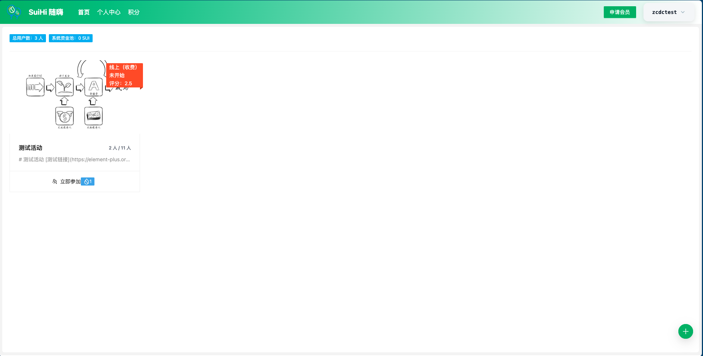
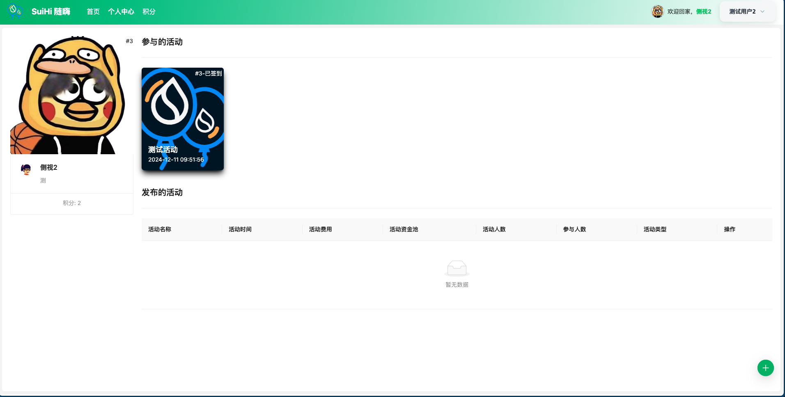
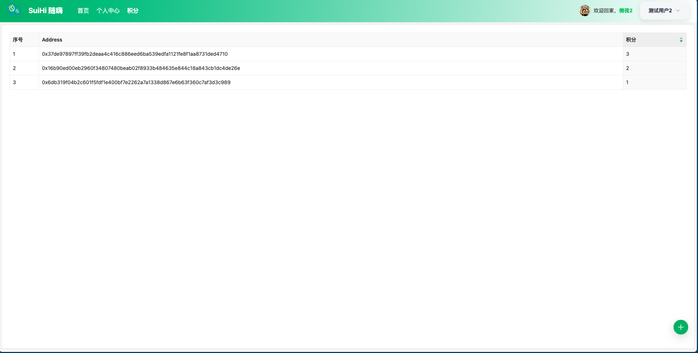
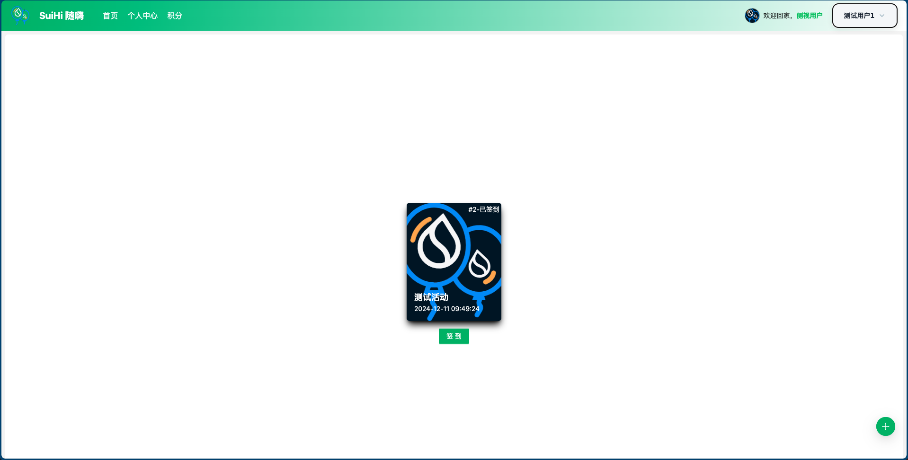
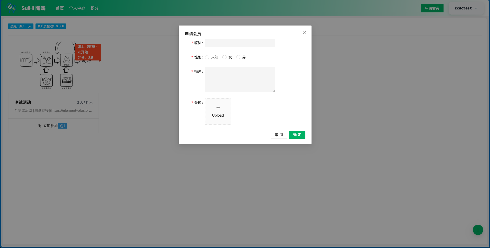
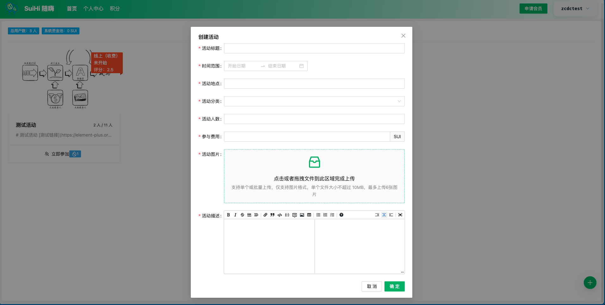
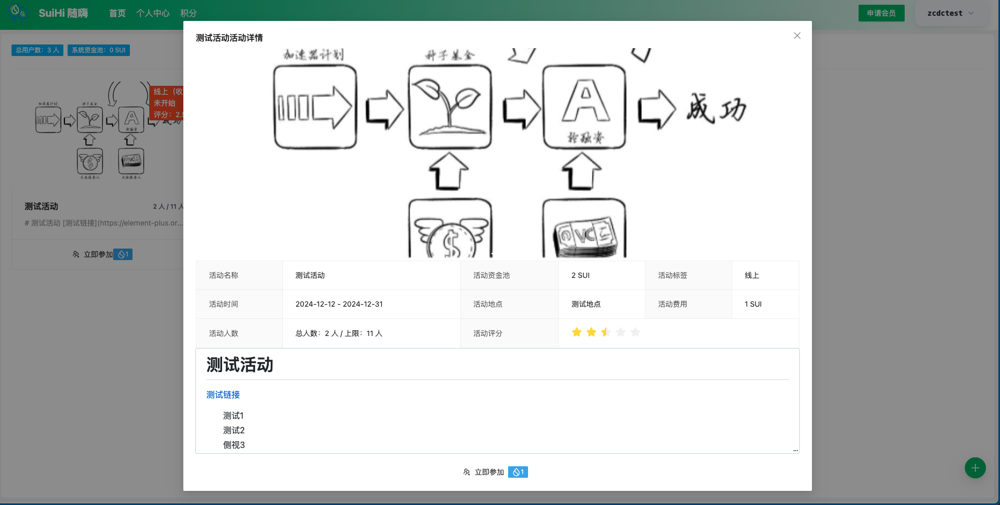

## project
- 项目名称: SuiHi 随嗨
> 描述: 活动发布平台，在申请会员之后，可以进行活动的发布、参与、签到和评分。活动发布可以设置费用，参与者缴纳后即可参与。活动发布者可对活动费用进行提取，但是平台需要收取手续费。活动发布者可以根据活动生成签到链接/二维码，参与者可以对参与的活动进行签到。所有交互都会产生积分，方便后续的奖励兑换。基于sui的合约进行活动和人员管理，基于walrus进行图片资源存储。

## Demo地址
[https://sui-hi.walrus.site/](https://sui-hi.walrus.site/)

### 1. 申请会员

https://github.com/user-attachments/assets/d2ba6798-4f31-432b-a379-f6c034e9b2b2

### 2. 创建活动

https://github.com/user-attachments/assets/57e11ad7-3adf-417c-a794-7aa3e613c64f

### 3. 参加活动

https://github.com/user-attachments/assets/808b9243-5f74-4b34-bba0-109f52df83a9

### 4. 活动签到

https://github.com/user-attachments/assets/b6b910de-5d38-409a-b135-395f95907ec2

### 5. 活动评分

https://github.com/user-attachments/assets/b135f1ab-4206-41af-9897-04c9e2d42cb5

### 6. 提取活动经费

https://github.com/user-attachments/assets/640e7ca7-fad4-4fe8-8e0e-6fae35dd4bef

### 7. 积分排名

https://github.com/user-attachments/assets/6bafbd89-e2b3-43a3-b6c0-0d7e537c7b93

## 页面截图

- 首页

- 个人中心

- 积分列表

- 签到页

- 申请会员

- 创建活动

- 活动详情

